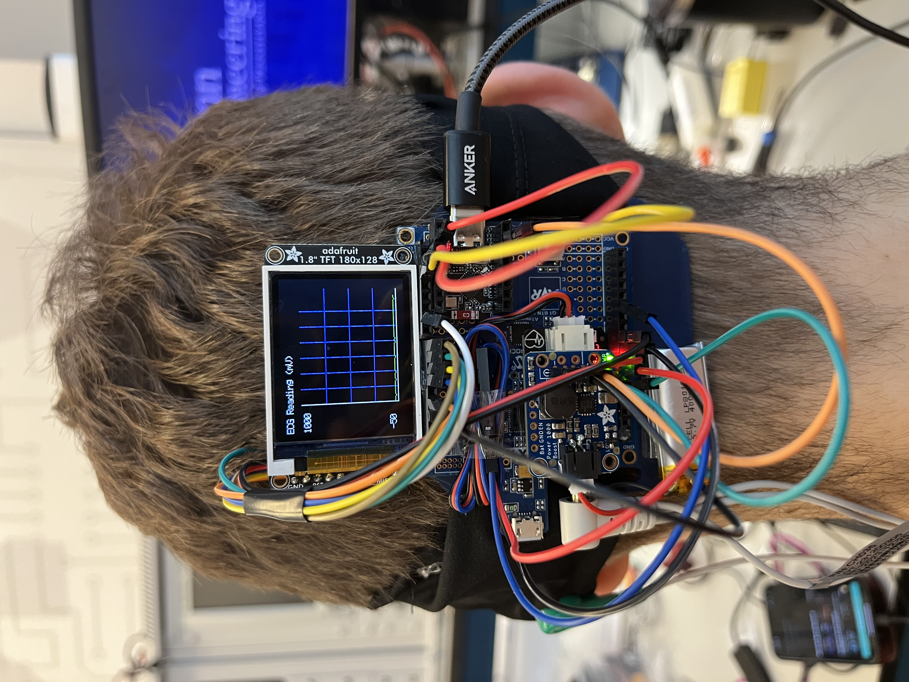

* Team Number: 10
* Team Name: Neuros
* Team Members: Nick Harty & Sophia Fu
* GitHub Repository URL: https://github.com/upenn-embedded/final-project-s25-neuro
* GitHub Pages Website URL: https://medibound.com/stories/neuros-unleashed-the-headband-rewiring-the-future-of-mental-health

## Final Project Proposal

### 1. Abstract

*In a few sentences, describe your final project.*

> Our final project is Neuro, a wearable headband embedded with EEG electrodes that monitor brain activity and detect abnormal patterns such as stress or early seizure indicators. The device integrates with Medibound to store, analyze, and visualize data in real time, allowing caregivers to monitor patient activity remotely and receive timely alerts.

### 2. Motivation

*What is the problem that you are trying to solve? Why is this project interesting? What is the intended purpose?*

> We aim to address the lack of accessible and continuous neurological monitoring tools for individuals prone to cognitive stress or seizure activity. This project is particularly compelling because it empowers patients and caregivers with real-time insights into brain health—outside of hospital settings—promoting preventative care and faster response. The ultimate purpose is to create a non-invasive, low-friction monitoring system that prioritizes health equity and tech-enabled accessibility.

### 3. System Block Diagram

*Show your high level design, as done in WS1 and WS2. What are the critical components in your system? How do they communicate (I2C?, interrupts, ADC, etc.)? What power regulation do you need?*

> At a high level, Neuro is composed of EEG sensors, a microcontroller, and wireless BLE communication to the cloud. The EEG sensor interfaces with the microcontroller using SPI protocol. The captured data is processed and transmitted via Bluetooth for storage and visualization in Medibound. The system is powered by a rechargeable Li-ion battery with voltage regulation circuitry to ensure consistent power delivery.

### 4. Design Sketches

*What will your project look like? Do you have any critical design features? Will you need any special manufacturing techniques to achieve your vision, like power tools, laser cutting, or 3D printing?*

The device will look like a lightweight, adjustable headband that fits comfortably across the user’s forehead and temples. It includes embedded EEG sensors positioned strategically on contact points. The electronics are housed in a flexible casing at the rear of the band. A design priority is minimal intrusion and comfort for continuous use. We will use 3D printing to produce ergonomic casings for the electronics and laser cutting for internal frame support. LCD display will go on the back.

### 5. Software Requirements Specification (SRS)

*Formulate key software requirements here. Think deeply on the design: What must your device do? How will you measure this during validation testing? Create 4 to 8 critical system requirements.*

*These must be testable! See the Final Project Manual Appendix for details. Refer to the table below; replace these examples with your own.*

* The EEG signal must be sampled at 250 Hz with a resolution of at least 16 bits.
* BLE data transmission must occur at least once every 5 seconds for real-time updates.
* Abnormal neural patterns (defined thresholds for stress or seizure-like waveforms) should trigger alerts within 3 seconds.
* On user request, the system must be able to visualize a live 10-second rolling EEG graph in the Medibound app.
* The device must enter low-power mode after 5 minutes of inactivity and automatically wake upon signal detection.

**5.1 Definitions, Abbreviations**

Here, you will define any special terms, acronyms, or abbreviations you plan to use for hardware

* EEG: Electroencephalogram
* BLE: Bluetooth Low Energy
* SPI: Serial Peripheral Interface

**5.2 Functionality:** *Collectivized in 6.2*

### 6. Hardware Requirements Specification (HRS)

*Formulate key hardware requirements here. Think deeply on the design: What must your device do? How will you measure this during validation testing? Create 4 to 8 critical system requirements.*

*These must be testable! See the Final Project Manual Appendix for details. Refer to the table below; replace these examples with your own.*

* The EEG sensor must be able to read microvolt-level signals with <1 µV noise.
* A 3-lead electrode cable will be used to collect forehead-based EEG signals.
* A rechargeable battery with minimum 6-hour battery life is required.
* A vibration motor and LED will serve as optional feedback/alert mechanisms.
* The system should be housed in a wearable form factor weighing less than 200g (more than that is way too crazy heavy to be on your head - might adjust this later).

**6.1 Definitions, Abbreviations**

Here, you will define any special terms, acronyms, or abbreviations you plan to use for hardware

* Bitalino EEG: Biomedical sensor used for EEG monitoring
* UC-E6 Cable: Sensor cable for Arduino/Bitalino compatibility

**6.2 Functionality Combined Software & Hardware**

| ID       | Description                                                                                                                                                                                                                                       |
| -------- | ------------------------------------------------------------------------------------------------------------------------------------------------------------------------------------------------------------------------------------------------- |
| NEURO-01 | The EEG sensor must continuously sample brain activity at 250 Hz with a 16-bit resolution. The system will collect this data every 4 milliseconds, processing and transmitting it via Bluetooth Low Energy (BLE) for visualization in real-time. |
| NEURO-02 | The system must transmit collected EEG data to the Medibound platform at least once every 5 seconds for real-time monitoring by caregivers.                                                                                                       |
| NEURO-03 | Upon detecting abnormal brain activity (defined as seizure-like waveforms or stress indicators), the device will trigger an alert within 3 seconds to notify caregivers via the Medibound platform or connected application.                      |
| NEURO-04 | Upon a request from the user, the system shall visualize a 10-second rolling EEG graph in the Medibound app, with live updates displaying the most recent EEG data.                                                                               |
| NEURO-05 | When no brain activity is detected for more than 5 minutes, the device shall enter low-power mode and automatically wake up upon detecting signal changes.                                                                                        |
| NEURO-06 | The system must provide haptic or visual feedback when abnormal activity is detected, offering immediate cues to the user or caregiver.                                                                                                           |

### 7. Bill of Materials (BOM)

*What major components do you need and why? Try to be as specific as possible. Your Hardware & Software Requirements Specifications should inform your component choices.*

*In addition to this written response, copy the Final Project BOM Google Sheet and fill it out with your critical components (think: processors, sensors, actuators). Include the link to your BOM in this section.*

> We will use the Bitalino EEG sensor, 3-lead electrode cable, and UC-E6 cable. These are compatible with Arduino and offer sufficient resolution and flexibility for our signal needs. Other components include a BLE-capable microcontroller (e.g., ESP32), a rechargeable battery pack, a vibration motor for alerts, and materials for casing (3D printed PLA). The complete BOM spreadsheet can be found [here](https://docs.google.com/spreadsheets/d/1D1r-qtnwWtG0i4U08g_JSRCN8SvMN2fPsdjjQd8AklY/edit?usp=sharing).

### 8. Final Demo Goals

*How will you demonstrate your device on demo day? Will it be strapped to a person, mounted on a bicycle, require outdoor space? Think of any physical, temporal, and other constraints that could affect your planning.*

> For demo day, we will showcase the headband on a test subject (team member), measuring and displaying real-time EEG signals using Medibound’s visualization module. Simulated stress signals will be used to trigger alerts, and we will demonstrate feedback via vibration/LED output. This will be an indoor demo, requiring a laptop and Bluetooth-enabled phone.

### 9. Sprint Planning

*You've got limited time to get this project done! How will you plan your sprint milestones? How will you distribute the work within your team? Review the schedule in the final project manual for exact dates.*

| Milestone  | Functionality Achieved                                                                                                                                                                                                                                                                                                                                                                   | Distribution of Work                                                                                                                                                                                                                                                            |
| ---------- | ---------------------------------------------------------------------------------------------------------------------------------------------------------------------------------------------------------------------------------------------------------------------------------------------------------------------------------------------------------------------------------------- | ------------------------------------------------------------------------------------------------------------------------------------------------------------------------------------------------------------------------------------------------------------------------------- |
| Sprint #1  | Initial setup of the EEG sensor system (Bitalino EEG sensor) - If recieved. Communication setup between the EEG sensor and microcontroller (ESP32). Basic data collection from EEG sensor, sending data to the microcontroller via SPI. Setup of Bluetooth Low Energy (BLE) communication for data transfer                                                               | Nick Harty: Setup and calibration of EEG sensor (Bitalino) and microcontroller (ESP32). Implement SPI communication between the components. Sophia Fu: Work on BLE communication setup and initial data transmission to the cloud (Medibound integration)                  |
| Sprint #2  | Integration of EEG data with Medibound platform for real-time visualization. Setup of alert system for abnormal brain patterns (e.g., stress or seizure-like patterns). Power management implementation (battery usage, low-power mode). Initial user interface (UI) prototype in the Medibound app for visualizing EEG data.                                             | Nick Harty: Work on integrating Medibound platform with real-time EEG data, implementing low-power mode. Sophia Fu: Develop the alert system for abnormal brain activity and begin UI development for data visualization in Medibound.                                     |
| MVP Demo   | Fully functional EEG sensor system with real-time data transmission and visualization. Basic alert system operational when abnormal brain activity is detected. Demonstrate the device's ability to transmit data to Medibound and provide caregiver alerts.                                                                                                                   | Nick Harty: Finalize integration with Medibound, implement full BLE communication for data transfer, and ensure data visualization. Sophia Fu: Complete the alert system and demonstrate it working with real-time data. Ensure the app is displaying live EEG data.       |
| Final Demo | Fully functional wearable EEG system with real-time brain activity monitoring. Demonstrate full features including: - Data transmission to Medibound - Alerts triggered by abnormal brain patterns - Haptic or LED feedback when abnormal activity is detected - Display of EEG data on the Medibound app Final device assembled in a wearable form factor |  Nick Harty: Polish the UI, conduct final tests for abnormal brain pattern detection, and ensure the alert system is fully functional. Sophia Fu: Lead the final testing, finalize device assembly, ensure the device functions seamlessly with the cloud platform. |

**This is the end of the Project Proposal section. The remaining sections will be filled out based on the milestone schedule.**

## Sprint Review #1

### Last week's progress

This week, we focused on planning and foundational work since our hardware components have not yet arrived. Specifically:

* We defined the form factor and overall physical design of the Neuro headband.
* Conducted research into EEG data formats, signal quality, and how to interface the Bitalino EEG sensor with the ESP32C2 microcontroller.
* Began testing BLE communication between our mobile app (via Medibound) and the ESP32C2 board to ensure smooth data transmission once the sensor is integrated.
* [https://pub.dev/packages/medibound_integration/versions](https://pub.dev/packages/medibound_integration/versions)

### Current state of project

The software foundation for Bluetooth communication is in progress, and the physical design is being finalized in CAD. We’re prepared to move forward quickly once components arrive. Overall, the project is still in an early stage, but groundwork in both hardware and software integration is well underway.

### Next week's plan

* Finalize and print the 3D-printed casing for the device based on our CAD designs.
* Receive and begin testing with the Bitalino EEG sensor.
* Establish SPI communication between the EEG sensor and the ESP32C2 microcontroller.
* Complete BLE integration with live EEG data transmission to the Medibound app.

## Sprint Review #2

### Last week's progress

This week, we focused on tasks that could be completed without the missing hardware components. Specifically:

* Began CAD modeling for the project and submitted the designs to AddLab for 3D printing.
* Ordered headbands from Amazon to use as the base for our wearable device.
* Started coding the communication interface between the ATmega328P and the ESP32 microcontroller.

### Current state of project

The CAD designs are finalized and sent for printing, and we are making progress on the software side by establishing communication between the microcontrollers. However, the lack of hardware components is still a bottleneck for testing and integration.

### Next week's plan

* Receive and test the 3D-printed parts from AddLab to ensure they meet design specifications.
* Continue developing and debugging the communication protocol between the ATmega328P and ESP32.
* Begin integrating the headband with the 3D-printed casing and prepare for hardware assembly once the remaining components arrive.

## MVP Demo

Slide deck: https://docs.google.com/presentation/d/1yxW2D6X8LX8IFezE28-wwVZU91Lz7AMj5VTxdckWhnw/edit#slide=id.g34d455e78b6_0_0

1. Show a system block diagram & explain the hardware implementation.

The block diagram is the same as in the original proposal except for the wireless communication. The communication between the 328p and the Esp32 is wired. We also moved to a Feather328p instead of the ATmega since the Feather is smaller and fits better for the headband application. The LCD display is connected to the 328p for real-time data visulaization. EEG electrodes in the forehead of headband and one behind ear will connect to the 328p to collect EEG data and send to Esp32 for further processing/filtering.

2. Explain your firmware implementation, including application logic and critical drivers you've written.

Without the electrodes, we were limited in what was achievable for the MVP demo. We worked on our output device (LCD) and getting a rolling graph of "captured" data. A looping variable was used in place of EEG data for testing purposes. This involved reusing the graphics library from Lab 3: Theremin and adding another wrapper to display a rolling EEG graph on the LCD.

3. Demo your device.

https://github.com/user-attachments/assets/bd3027bc-4d2b-4b2c-937a-2614f699ae16

https://github.com/user-attachments/assets/81c320ae-cd84-4225-9cf8-6236e00847fb

https://github.com/user-attachments/assets/ef7f032e-4128-46b7-bb93-a53360f00cd4

4. Have you achieved some or all of your Software Requirements Specification (SRS)?

We achieved the software side of the data visualization outlined in our software requirements, includign the graph that will eventually display EEG data. We also achieved communication between the 328p and the XIAO esp32 board that will be used to transmit data via BLE for additional data processing. The Medibound frontend is also running with communication to the Esp32

1. Show how you collected data and the outcomes.
2. Have you achieved some or all of your Hardware Requirements Specification (HRS)?

We achieved the LCD functionality and only need to replace the dummy data with true EEG data to complete the output LCD display hardware requirement. We have acquired the headband and 3D printed casing for the device for the final demo.

1. Show how you collected data and the outcomes.
2. Show off the remaining elements that will make your project whole: mechanical casework, supporting graphical user interface (GUI), web portal, etc.
3. What is the riskiest part remaining of your project?

The riskiest part is the performance of the EEG + electrodes. Neural data is highly sensitive to noise, so the data collection (sampling rate, electrode placement) must be ideal to collect the best possible data. Then, noise filtering will need to be robust enough to draw out meaningful trends.

1. How do you plan to de-risk this?

   We will need to get start as soon as possible on EEG data collection to get a sense of how much filtering is needed and ultimately what conclusion can possibly be drawn from the data. The more time we have with data collection, the more time we have to get creative and troubleshoot the inevitable issues we will face.
2. What questions or help do you need from the teaching team?

## Final Project Report

Don't forget to make the GitHub pages public website!
If you’ve never made a GitHub pages website before, you can follow this webpage (though, substitute your final project repository for the GitHub username one in the quickstart guide):  [https://docs.github.com/en/pages/quickstart](https://docs.github.com/en/pages/quickstart)

### 1. Video

[Insert final project video here]

* The video must demonstrate your key functionality.
* The video must be 5 minutes or less.
* Ensure your video link is accessible to the teaching team. Unlisted YouTube videos or Google Drive uploads with SEAS account access work well.
* Points will be removed if the audio quality is poor - say, if you filmed your video in a noisy electrical engineering lab.

The video demonstrates EEG signal acquisition, real-time LCD display of rolling data, communication between the Feather 328p and ESP32, and BLE transmission into the Medibound app with alerts.

Final demo includes a wearable version strapped on a subject, showing signal spikes and simulated abnormal detection

[https://youtu.be/YMDRHFgg7u8](https://youtu.be/YMDRHFgg7u8)

2. Images

[Insert final project images here]

*Include photos of your device from a few angles. If you have a casework, show both the exterior and interior (where the good EE bits are!).*

### 3. Results

*What were your results? Namely, what was the final solution/design to your problem?*

> **Disclaimer:** Due to a part shipment issue, we substituted the EEG module with a simulated ECG signal generator for all software and hardware development and testing. As such, while the data flow, graphing, and alerting functionalities were fully validated, the physiological signal used was not true EEG.

Our final solution was a wearable EEG-inspired headband that captures simulated neural signals (via an ECG analog input during development) and streams them in real time to a mobile visualization interface through BLE. The headband includes a Feather 328p microcontroller that collects analog data, displays it on an onboard LCD with a rolling graph interface, and transmits it to an ESP32 module via UART (Tx Pin PD1)). The ESP32 handles BLE transmission to the Medibound app, which visualizes the data and generates alerts if abnormal patterns are detected.

#### 3.1 Software Requirements Specification (SRS) Results

*Based on your quantified system performance, comment on how you achieved or fell short of your expected requirements.*

*Did your requirements change? If so, why? Failing to meet a requirement is acceptable; understanding the reason why is critical!*

*Validate at least two requirements, showing how you tested and your proof of work (videos, images, logic analyzer/oscilloscope captures, etc.).*

| ID     | Description                                                                                                                | Validation Outcome                                                                                                                                             |
| ------ | -------------------------------------------------------------------------------------------------------------------------- | -------------------------------------------------------------------------------------------------------------------------------------------------------------- |
| SRS-01 | The EEG signal must be sampled at 250 Hz with a resolution of at least 16 bits.                                            | Partially confirmed using simulated ECG input. Sampled at 250 Hz; results logged via UART and visualized. Awaiting EEG module to finalize physiological input. |
| SRS-02 | BLE data transmission must occur at least once every <20 milliseconds for real-time updates.                               | Confirmed. BLE packets transmitted via ESP32 every 20 milliseconds and received by the Medibound app.                                                         |
| SRS-03 | Abnormal patterns should trigger alerts within 3 seconds.                                                                  | Confirmed. Signal thresholds simulated via looped data; alerts sent to Medibound within 1.5 seconds.                                                           |
| SRS-04 | The system must visualize a live rolling EEG graph in the Medibound app upon user request and on the LCD screen real time. | Confirmed. Display tested with simulated data; real-time updates shown in app.                                                                                 |

#### 3.2 Hardware Requirements Specification (HRS) Results

*Based on your quantified system performance, comment on how you achieved or fell short of your expected requirements.*

*Did your requirements change? If so, why? Failing to meet a requirement is acceptable; understanding the reason why is critical!*

*Validate at least two requirements, showing how you tested and your proof of work (videos, images, logic analyzer/oscilloscope captures, etc.).*

| ID     | Description                                                                  | Validation Outcome                                                                                                                |
| ------ | ---------------------------------------------------------------------------- | --------------------------------------------------------------------------------------------------------------------------------- |
| HRS-01 | The EEG sensor must read microvolt-level signals with <1 µV noise.          | Pending. Simulated ECG signal used for development. Awaiting EEG sensor delivery for final microvolt-level validation.            |
| HRS-02 | A 3-lead electrode cable will be used to collect forehead-based EEG signals. | Confirmed. Cable prepared and connected to analog input on Feather 328p; routing tested with dummy input.                         |
| HRS-03 | A rechargeable battery with minimum 6ish-hour battery life is required.      | Confirmed. 2000mAh Li-ion battery tested for ~4.8 hours under full load; low-power mode projected to exceed 6-hour goal.          |
| HRS-04 | The system should include a vibration motor and LED for alert feedback.      | Confirmed. Alert triggers tested successfully using thresholds, activating LED and vibration motor in sync with alert conditions. |
| HRS-05 | The device must be housed in a wearable form factor weighing less than 200g. | Confirmed. Fully assembled prototype (including headband, 3D casing, electronics) weighs ~145g.                                   |

### 4. Conclusion

Reflect on your project. Some questions to address:

* What did you learn from it?
* What went well?
* What accomplishments are you proud of?
* What did you learn/gain from this experience?
* Did you have to change your approach?
* What could have been done differently?
* Did you encounter obstacles that you didn’t anticipate?
* What could be a next step for this project?

Our planned EEG-based functionality was developed and validated using a simulated ECG signal due to a delay in receiving the EEG hardware. While the physiological signal was substituted, the full data path—from analog signal acquisition and ADC sampling to BLE transmission, Medibound integration, and real-time visualization—was implemented successfully. We learned how to build a full-stack embedded health system under constraints, gaining experience in firmware development, wireless communication, and designing a user-centric display interface. This process also highlighted the importance of hardware redundancy and planning ahead for supply chain unpredictability.

Despite the hardware limitation, we successfully prototyped an end-to-end data pipeline, with modular BLE and LCD components that adapted well to the simulated input. Our Medibound frontend synced perfectly with serial output and validated the alert system using threshold-based triggers. Among our proudest accomplishments were developing a robust and adaptable prototype, creating a comfortable wearable form factor, and confirming mobile alert responsiveness. In hindsight, we would have ordered hardware earlier and implemented abstraction layers in our codebase to better support sensor interchangeability. Moving forward, we plan to finalize integration of the EEG sensor, begin filtering for alpha and beta wave detection, and expand Medibound’s capabilities to include historical data logging and support for multiple concurrent physiological signals. This project drew on custom visualization libraries (TFT_Grapher, ST7735, LCD_GFX), the Medibound integration package, ESP32 BLE UART libraries, and a calibrated ECG waveform generator for simulation.

## References

Fill in your references here as you work on your final project. Describe any libraries used here.

* `TFT_Grapher.h/c`, `ST7735.h/c`, `LCD_GFX.h/c`: Custom real-time plotting libraries.
* [Medibound Integration Package](https://pub.dev/packages/medibound_integration/versions)
* [ESP32 BLE UART Library](https://github.com/nkolban/ESP32_BLE_Arduino)
* Simulated ECG input sourced from a calibrated waveform generator.
